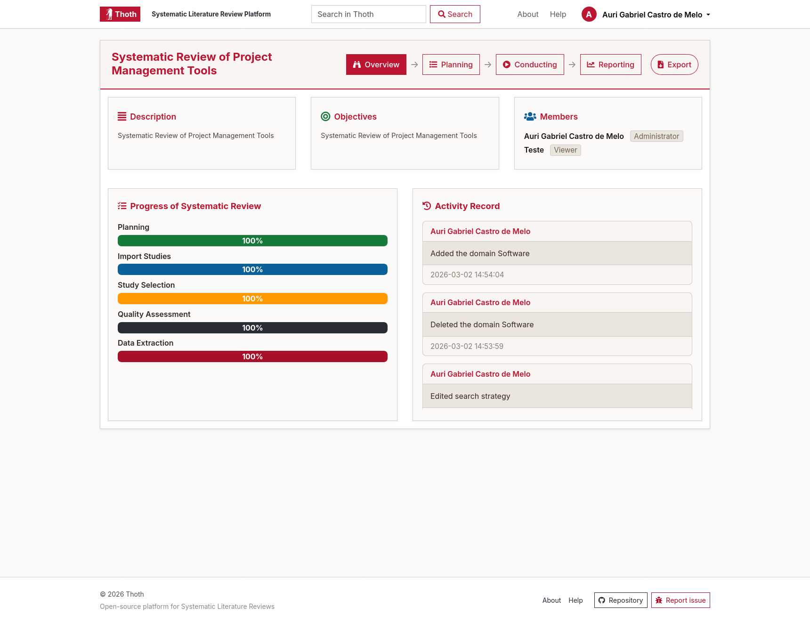

# Thoth: Systematic Literature Review Platform [](https://github.com/auri-gabriel/Thoth)

Thoth is a web platform that supports the workflow of a Systematic Literature Review (SLR), including project organization, extraction activities, and progress tracking.

## Legacy version notice

> This repository contains the **legacy version** of Thoth, intended mainly for educational, experimental, and archival use.
>
> For production usage and the latest features, visit **[Thoth 2.0](https://thoth-slr.com/)**.

This refactored legacy codebase is maintained for historical interest and community contributions. It is **not recommended for mission-critical usage**.

## Screenshot

<p align="center">
   
</p>

<p align="center"><em>Example of the Thoth dashboard and progress tracking interface.</em></p>

## Getting started (Docker)

Use Docker Compose to run Thoth locally.

### 1) Clone the repository

```sh
git clone https://github.com/auri-gabriel/thoth.git
cd thoth
```

### 2) Install PHP dependencies

```sh
composer install
```

### 3) Configure application files

```sh
cp application/config/database_sample.php application/config/database.php
cp application/config/config_sample.php application/config/config.php
```

Optionally edit these files to match your local database settings.

### 4) Start containers

```sh
docker compose up --build
```

Application URL: [http://localhost:8080](http://localhost:8080)

### 5) Initialize the database

```sh
docker exec -i <mysql_container_name> mysql -uthoth -pthoth thoth < docs/database/thoth.sql
```

Replace `<mysql_container_name>` with your actual container name (for example, `thoth-db-1`).

### 6) Session directory permissions (if needed)

If you get session path/permission errors:

```sh
mkdir -p application/cache/sessions
chmod 777 application/cache/sessions
```

### 7) Default credentials

Check the database seed data (or ask your admin) for available default users.

### 8) Stop containers

```sh
docker compose down -v
```

## Troubleshooting

- If login fails, confirm the SQL import was executed successfully.
- If sessions do not persist, verify `application/cache/sessions` exists and is writable.
- If containers fail to start, run `docker compose logs` to inspect service errors.

## Contributing

Contributions are welcome. See [contributing.md](contributing.md) for contribution guidelines.

## License

This project is licensed under the MIT License. See [license.txt](license.txt) for details.

## Contact

For questions or support, open an issue in this repository: [auri-gabriel/thoth](https://github.com/auri-gabriel/thoth).

